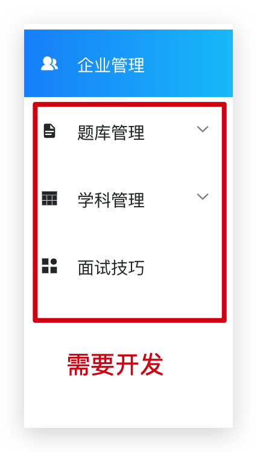
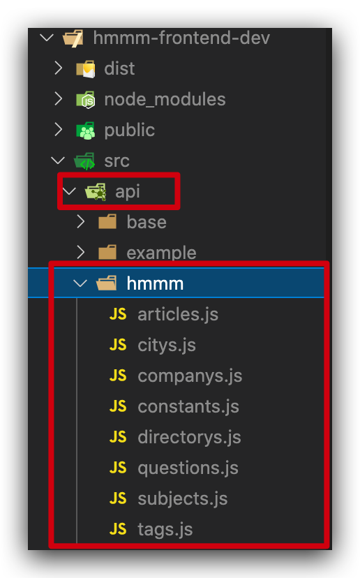
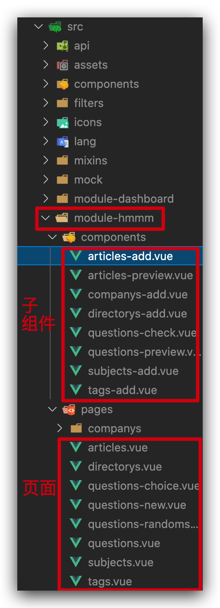

## 团队实战流程梳理

### 实战目的

1. 锻炼学生**独立开发和解决问题的能力**
2. 熟悉**真实企业开发的流程**
3. 查漏补缺和自我提升

> 项目启动大会 => 产品经理讲讲项目做什么，有什么需求 => 前后端评估需求，是否能实现 => 排期 => 开干

### 项目实战5天安排

| 时间 | 上午（8:30 - 12:15）                                         | 下午（14:30 - 18:15）         |
| ---- | ------------------------------------------------------------ | ----------------------------- |
| day1 | 项目说明、初始化小组项目仓库、分配功能 + 领取任务、注册 tower 账号 | 进入开发阶段（组长汇报进度）  |
| day2 | 正常开发                                                     | 正常开发（组长汇报进度）      |
| day3 | 正常开发                                                     | 正常开发（组长汇报进度）      |
| day4 | 正常开发                                                     | 提交测试进入测试阶段/修复 bug |
| day5 | 答辩验收 + 评分                                              | 答辩验收 + 评分               |

### 开发准备

> 说明❓：后台环境不是必须搭建，可以**直接使用**：http://8.142.65.7:7001/    |   http://hmmm-api.itheima.net 开发

查阅**开发指引**
1. 了解项目背景
2. **项目需求和要实现的功能**
3. 项目接口文档=>**接口已经封装好**
4. 搭建开发环境，**把项目跑起来**
   1. 组长拷贝**前端代码**=>跑起来=> 查看项目结构
      1. 前端代码：https://gitee.com/on_my_own_way/heimamm-team
   2. 组长
      1. 初始化好远程仓库
      2. 组长在本地建立好3个分支：master(默认上线分支)  release(上线版本)  develop（开发）
      3. 每个人从develop分支建立自己的开发分支开发功能=》develop-你的功能
      4. 开发完自测后，merge到develop分支进行测试
      5. 所有功能开发测试完组长把develop分支代码merge到release分支，进行最终测试
      6. 最后merge到master分支上线
      7. 添加项目成员
   3. 组员
      1. 拉取这三个分支
5. **熟悉项目的真实开发流程**
6. 项目完成后，打包部署
7. 开发需要关注的文档=》**开发指引**
8. 项目答辩

### 项目目录

> 开发需要关注目录文件

1. 后台接口
   
2. 前端页面
   

### 问题说明

1. 组长建立仓库是开源的，不要建立私有仓库
2. 实际开发使用本地端口号7001的node后台服务，线上有些接口报500，只作为参考
3. 开发中**接口文档会有错误**，以线上演示接口调用传参为准

### 使用 Tower 管理项目进度

1. 注册 tower 帐号
2. 创建项目结构：
   1. 敏捷迭代
   2. Bug 管理
3. 添加项目成员

### 时间安排

> 中间时间各组自己安排

上午：12：15下课

下午：18：15下课

### 开发说明

> 自己独立完成功能和分析解决bug

* 开发功能

1. 结合**需求文档和线上演示**分析实现步骤和使用的技术
2. 使用element的layout组件（24栅格）布局
3. 逐步实现CRUD功能（CRUD是指增加(Create)、读取查询(Retrieve)、更新(Update)和删除(Delete)几个单词的首字母简写）

* 开发中遇到的bug

常用bug:

1. 语法错误
2. 导入、命名、拼写、大小写等
3. 没写到圈里

解决：

1. 确定什么情况下出现的 => 第一次加载页面或点击某个按钮
2. 定位到具体的代码
3. 通过console.log、vue-devtools或一行行注释代码

### GIT工作流

流程预览：https://www.processon.com/view/link/5e9bbe0be0b34d6feab88954

1. 组长创建项目和分支，推送到远端仓库=》master（上线分支） release-XX（发布版本分支=》多个）      dev(开发分支)
2. 组员克隆组长仓库，拉取分支（注意：跟远端建立连接）
3. 基于dev新建自己的个人开发分支，然后推送到远端仓库=》基于自己的分支开发
4. 开发完，先把自己分支的代码push到远端，然后切换dev进行合并
5. 合并之前，先git pull拉更新；然后执行git merge 自己的分支名，最后git push
6. 运行dev分支代码测试=》npm run serve =>看看代码运行是否正常，代码在否
7. 合并完毕，中间出现bug，回到个人分支修复后，重复4-6部操作
8. 等到dev分支包含所有人的代码，然后合并到release分支准备上线
9. 上线前在release分支，做最后的全功能测试；如果出现bug直接在release分支拉取单独分支修复后，再合并回去
10. 最终把release分支的代码合并到master上线

注意⚠️：

1. 合并代码，和别人出现冲突要和当事人确认，共同进行合并
2. 冲突合并，可以借助vscode分支管理，进行解决
3. 解决完冲突，需要再次暂存提交，最后把代码提交到远程仓库

### 每天早上站会

> **组长组织**，了解进度和问题及今天开发安排（疫情期间使用腾讯会议组织）

### 答辩总结

> 最后一天答辩

1. 项目介绍：（项目背景，成员分工：开发/测试人员，功能介绍，整体完成度...）
2. 技术亮点&难点：（挑选部分内容讲解代码和业务）
3. **收获&体会**
4. 其他

一定要有的：

​	（1）小组成员的介绍，照片，分工..

​	（2） 开早会的照片

​	（3）看板的照片（tower）

​    （4）每天的日志（截图）

